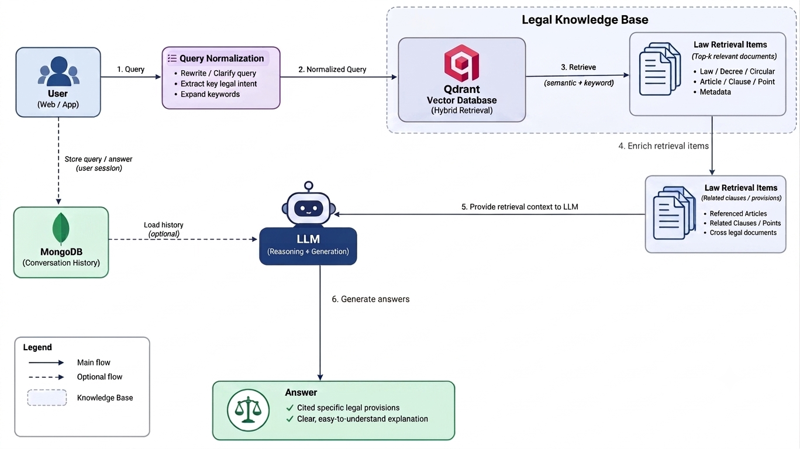

# Vietnamese Traffic Law Question Answering RAG System

## 1. Introduction

The **Vietnamese Legal Document RAG (Retrieval-Augmented Generation)** system was developed to assist users in searching and resolving queries regarding road traffic laws in Vietnam. The system focuses on processing data from **Decree No. 168/2024/ND-CP** (a legal document specifying administrative penalties in the traffic sector featuring stricter deterrent penalties).

The primary goal of the system is to ensure **accuracy**, **full legal context** (including principal penalties, supplementary penalties, and cross-referenced clauses), and to prevent Large Language Model (LLM) hallucination.

---

## 2. Data Standardization

The original raw data was in Microsoft Word format (`.docx`). To support automated chunking and retrieval processes, the data was converted into **JSON** format, preserving the hierarchical structure of legal normative documents.

### 2.1. Raw Data JSON Structure

```json
{
  "document_title": "DOCUMENT TITLE",
  "legal_basis": "Entire Legal Basis section at the beginning of the document...",
  "chapters": [
    {
      "chapter_number": 1,
      "chapter_title": "CHAPTER TITLE",
      "articles": [
        {
          "article_number": 1,
          "article_title": "Article 1. Scope of regulation",
          "category": "Section ...",
          "clauses": [
            {
              "clause_number": 1,
              "content": "Content of Clause 1...",
              "points": [
                {
                  "point": "a",
                  "content": "Content of Point a...",
                  "references": [
                    {
                      "document": "168/2024/ND-CP",
                      "article": 6,
                      "clause": 2,
                      "point": "a"
                    }
                  ]
                }
              ],
              "references": []
            }
          ]
        }
      ]
    }
  ]
}
```

### 2.2. Meaning of Data Fields

| Data Field | Meaning |
| :--- | :--- |
| `document_title` | Full name of the legal normative document |
| `legal_basis` | The legal basis preamble section at the top of the document |
| `chapters` | List of chapters contained within the document |
| `chapter_number` / `chapter_title` | Chapter ordinal number and chapter title |
| `articles` | List of Articles belonging to a Chapter |
| `article_number` / `article_title` | Number and title of the Article |
| `category` | Section containing the Article (if the document is subdivided into Sections) |
| `clauses` | List of Clauses belonging to an Article |
| `clause_number` / `content` | Ordinal number and primary content of the Clause |
| `points` | List of Points (a, b, c...) belonging to a Clause |
| `point` / `content` | Point label and detailed content of the Point |
| `references` | Cross-references citing other Articles, Clauses, Points, or documents |

---

## 3. Chunking Strategy

From the hierarchical JSON data, the system performs data chunking according to context-preservation principles:

1. **Chunking Principles**:
   - Clause without Points $\rightarrow$ Formed into a standalone Chunk.
   - Clause with Points $\rightarrow$ Split each Point into an individual Chunk while **always retaining the parent Clause and parent Article content** to preserve global context.
2. **Chunk Format**:

```json
{
  "text": "[Document: Decree 168/2024/ND-CP]\n[Chapter I: GENERAL PROVISIONS]\n[Article 1. Scope of regulation]\nClause 1: Content of clause...",
  "metadata": {
    "document_title": "Decree ...",
    "document_short_name": "Decree 168/2024/ND-CP",
    "chapter_number": 1,
    "chapter_title": "GENERAL PROVISIONS",
    "article_number": 1,
    "article_title": "Article 1. Scope of regulation",
    "article_category": "",
    "clause_number": 1,
    "is_point": false,
    "point": null,
    "references": []
  }
}
```

3. **Data Representation**: The `text` field of each Chunk is processed through models to generate both **Dense Embeddings** (semantic) and **Sparse Embeddings** (BM25/SPLADE keywords) to support a **Hybrid Retrieval** mechanism.

---

## 4. System Architecture



The system operates across 5 key stages:

1. **Query Normalization**:
   - Expands general colloquial keywords into **synonymous legal terminology**.
   - *Example*: "xe máy" (motorbike) $\rightarrow$ "xe mô tô, xe gắn máy" (motorcycles, mopeds); "vượt đèn đỏ" (running a red light) $\rightarrow$ "không chấp hành hiệu lệnh của đèn tín hiệu giao thông" (failing to comply with traffic light signals).
   - Improves match capabilities during the Retrieval stage.

2. **Retrieval Stage (Hybrid Retrieval)**:
   - Retrieves relevant text chunks based on a combination of Dense Vector Search and Sparse Keyword Search.

3. **Reference Expansion**:
   - In legal texts, supplementary penalties or definitions frequently reference other Articles/Clauses (e.g., *"Penalized under Point a, Clause 2, Article 6"*).
   - This step automatically extracts metadata and retrieves additional cross-referenced Articles/Clauses.
   - **Advantages**: Minimizes omission of vital legal information (enhances completeness).
   - **Limitations**: Increases Context Length, which might dilute context if the initial Retrieval step selects irrelevant documents.

4. **Response Generation (with LLM)**:
   - Synthesizes text chunks from Retrieval and Expansion as Context for the LLM to generate precise answers, accompanied by explicit Article/Clause citations.

5. **Logging & History**:
   - Entire query histories, extracted contexts, and system responses are logged into a **MongoDB** database for monitoring and evaluation purposes.

---

## 5. System Evaluation & Metrics

### 5.1. Metric Concepts and Formulas

The system is evaluated across 2 stages: **Initial Retrieval** and **Document Expansion**.

A chunk is considered a **Match** with the Ground Truth (GT) dataset if it simultaneously satisfies: `Document Title` + `Article` + `Clause` + `Point` (if applicable).

#### Stage 1: Initial Retrieval Metrics
- **MRR (Mean Reciprocal Rank)**:
  - *Meaning*: Measures the rank position of the **first** correct document in the result list. The closer the correct result is to Top 1, the closer the MRR score is to 1.
- **Recall@K ($K = 1, 3, 5$)**:
  - *Meaning*: The proportion of ground-truth relevant documents found by the system within the **Top K** results.
- **NDCG@K ($K = 1, 3, 5$) (Normalized Discounted Cumulative Gain)**:
  - *Meaning*: Evaluates the ranking quality of the Top K results. Correct documents appearing at higher ranks yield higher NDCG scores (factoring in positional discount penalties).

#### Stage 2: Context Expansion Metrics
- **Final Recall (Recall@ALL)**:
  - *Meaning*: The proportion of correct documents retrieved out of the total Ground Truth after cross-reference expansion has been performed.

---

### 5.2. Detailed Evaluation Results

Evaluation was conducted on the standard benchmark dataset `evals_168_2024.json` using **100 real-world queries**:

#### Evaluation Results
| Metric | Top 1 ($K=1$) | Top 3 ($K=3$) | Top 5 ($K=5$) |
| :--- | :---: | :---: | :---: |
| **Recall@K** | 0.5950 | 0.7350 | 0.7433 |
| **NDCG@K** | 0.7700 | 0.7382 | 0.7469 |
| **MRR** | 0.8495 | - | - |
| **Final Recall** | **0.9350** | - | - |
